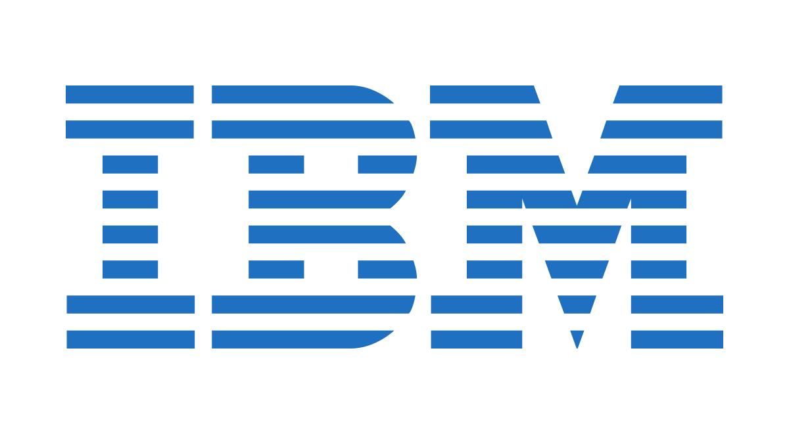

<h4><strong>Education</strong></h4>
<ul>
    <li> Ph.D. candidate in Electrical and Computer Engineering, University of Southern California, August 2025 </li>
    <li> B.S. in Electrical Engineering, National Taiwan University, June 2024 </li>
    Overall GPA: <strong>4.17/4.3</strong>, Major GPA: 4.17/4.3
</ul>  

<h4><strong>Experience</strong></h4>

  

    
  

  

    <strong>Graduate Research Assistant, Southern California Computer-Aided Design Lab, CA</strong> 
    <em>Sep 2025 – Current</em>
    <ul style="margin-top: 4px; margin-bottom: 0;">
      <!-- <li>Simultaneous Gate Sizing, Buffering, Sequential Routing, and Layer Assignment (NVIDIA, 2025-26)</li> -->
      <li>Global routing and Layer Assignment</li>
      <li>Advisor: Prof. Sung-Kyu Lim</li>
    </ul>
  

  

    
  

  

    <strong>Undergraduate Research Assistant, Electronic Design Automation Lab, Taipei</strong> 
    <em>Aug 2023 – Jan 2025</em>
    <ul style="margin-top: 4px; margin-bottom: 0;">
      <li>Reinforcement Learning for Macro Placement</li>
      <li>DeepONet-based Operator Learning for Warpage Prediction</li>
      <li>Advisor: Prof. Yao-Wen Chang</li>
    </ul>
  

  

    
  

  

    <strong>Research Intern, AI for EDA Group, IBM Research, CA</strong> 
    <em>Jun 2024 – Sep 2024</em>
    <ul style="margin-top: 4px; margin-bottom: 0;">
      <li>Agentic LLM framework for HDL code optimization</li>
    </ul>
  

  

    
  

  

    <strong>Undergraduate Research Assistant, Applied Logic and Computation Lab, Taipei</strong> 
    <em>Sep 2022 – Jun 2024</em>
    <ul style="margin-top: 4px; margin-bottom: 0;">
      <li>Qubit mapping for trapped-ion quantum computers with drive-through architecture</li>
      <li>Advisor: Prof. Jie-Hong Roland Jiang</li>
    </ul>
  

  

    
  

  

    <strong>Hardware Product Sprint, Google, New Taipei</strong> 
    <em>Jun 2023 – Sep 2023</em>
    <ul style="margin-top: 4px; margin-bottom: 0;">
      <li>Co-developed Translingo, a transparent display translation device with real-time gesture and speech recognition.</li>
    </ul>
  

<h4><strong>Awards</strong></h4>
<ul>
    <li> <strong>Taiwan Chip-based Industrial Innovation Program Research Scholarship, NSTC</strong>, Sep 2024 - Jan 2025 </li>
		<li> <strong>Scholarship for Overseas Internship Program, Ministry of Education,</strong> June 2024 - Aug 2024</li>
		<li> <strong>Research Scholarship, MediaTek-NTU Research Center</strong>, Mar 2024 - Jun 2024 </li>
    <li> <strong>Second Prize and Global Nominee, NASA Space App Challange</strong>, Oct 2023 </li>
		<li> <strong>College Student Research Scholarship, NSTC</strong>, Aug 2023 - Feb 2024 </li>
		<li> <strong>Dean's List Award 23'Spring, NTU</strong>, June 2023</li> 
</ul>