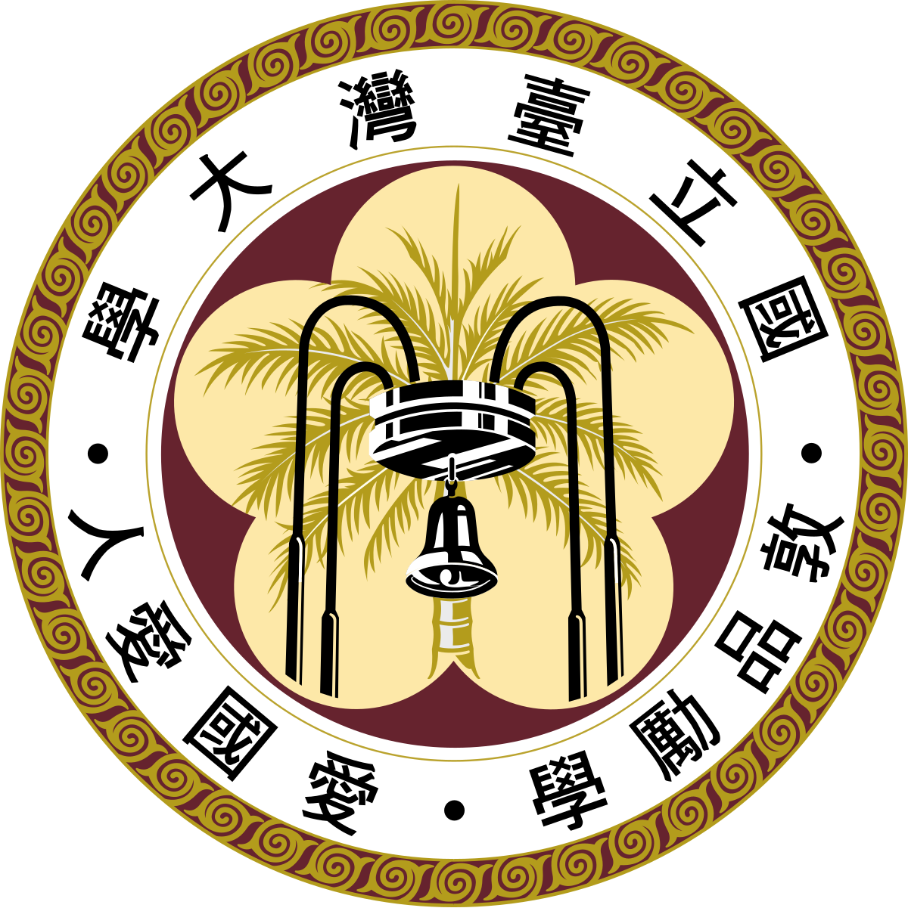
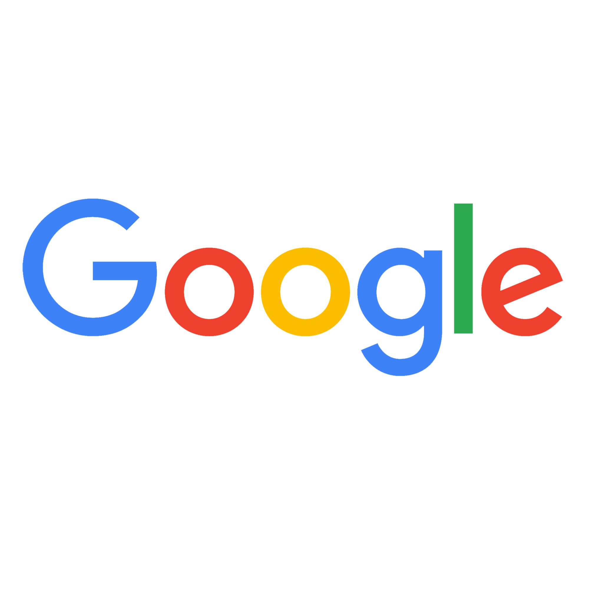

<h3><strong>Education</strong></h3>
<ul>
    <li> Ph.D. candidate in Electrical and Computer Engineering, University of Southern California, August 2025 </li>
    <li> B.S. in Electrical Engineering, National Taiwan University, June 2024 </li>
    Overall GPA: <strong>4.17/4.3</strong>, Major GPA: 4.17/4.3
</ul>  

<h3><strong>Experience</strong></h3>

<table>
  <tr>
    <td width="60">
      
    </td>
    <td>
      <strong>Undergraduate Research Assistant, Electronic Design Automation Lab</strong> 
      <em>Aug 2023 – Jan 2025</em> 
      <li>Researched in AI-driven EDA, focusing on reinforcement learning for placement optimization and operator learning for mechanical reliability prediction</li>
      <li>Advisor: Prof. Yao-Wen Chang</li>
    </td>
  </tr>
  <tr>
    <td>
      
    </td>
    <td>
      <strong>Research Intern, AI for EDA Group, IBM Research, CA</strong> 
      <em>Jun 2024 – Sep 2024</em> 
      <li> Developed MASCOT, an agentic LLM framework that integrates domain-specific knowledge for optimizing HDL code</li>
    </td>
  </tr>
  <tr>
    <td>
      
    </td>
    <td>
      <strong>Undergraduate Research Assistant, Applied Logic and Computation Lab</strong> 
      <em>Sep 2022 – Jun 2024</em> 
      <li> Researched in qubit mapping algorithms for trapped-ion quantum computers under architecture-specific constraints.</li>
			<li> Advisor: Prof. Jie-Hong Roland Jiang</li>
    </td>
  </tr>
  <tr>
    <td>
      
    </td>
    <td>
      <strong>Hardware Product Sprint, Google, New Taipei, Taiwan</strong> 
      <em>Jun 2023 – Sep 2023</em> 
      <ul>
        <li> Co-developed Translingo, a transparent display tranlation device, with real-time gesture and speech recognition.</li>
    </ul>
    </td>
  </tr>
</table>

<h3><strong>Awards</strong></h3>
<ul>
    <li> <strong>Taiwan Chip-based Industrial Innovation Program Research Scholarship, NSTC</strong>, Sep 2024 - Jan 2025 </li>
		<li> <strong>Scholarship for Overseas Internship Program, Ministry of Education,</strong> June 2024 - Aug 2024</li>
		<li> <strong>Research Scholarship, MediaTek-NTU Research Center</strong>, Mar 2024 - Jun 2024 </li>
    <li> <strong>Second Prize and Global Nominee, NASA Space App Challange</strong>, Oct 2023 </li>
		<li> <strong>College Student Research Scholarship, NSTC</strong>, Aug 2023 - Feb 2024 </li>
		<li> <strong>Dean's List Award 23'Spring, NTU</strong>, June 2023</li> 
</ul>